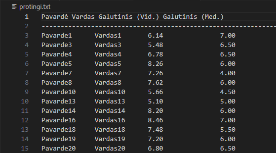
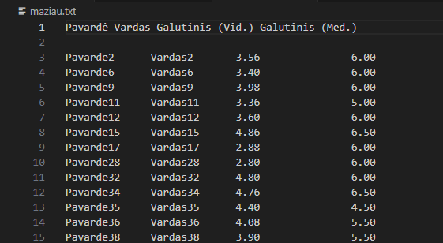

## Išpildymas

### Pakeitimai:
- Programa perrašyta naudojant klases vietoje struktūrų
- Pradėta naudoti `Student` klasė
- Atlikti pirmieji spartos testai su `list` ir `vector` konteineriais
- Sukurta bazinė testavimo infrastruktūra

### Rezultatų komentaras:
- `vector` konteineris parodė geresnį našumą didesniuose duomenų rinkiniuose
- `list` buvo lėtesnis dėl dažnų atminties prieigų
- Tai patvirtino, kad konteinerio pasirinkimas turi didelę įtaką bendram vykdymo laikui

### Rule of Three ir projekto struktūros pertvarkymas

### Pakeitimai:
- Implementuota **Rule of Three** (`copy ctor`, `operator=`, `destructor`) klasėje `Student`
- Perstruktūrizuotas projekto katalogų išdėstymas
- Atnaujintas `README.md` su detalesne spartos analize
- Patobulinta kodo skaitymo ir priežiūros kokybė

### Rezultatų komentaras:
- Rule of Three įdiegimas **neturėjo reikšmingos neigiamos įtakos našumui**
- Kopijavimo operacijos tapo aiškiai kontroliuojamos ir saugios
- Projektas tapo labiau paruoštas tolimesnei plėtrai ir testavimui

### Abstrakti bazinė klasė `Zmogus` ir paveldėjimas

### Pakeitimai:
- Pridėta abstrakti bazinė klasė `Zmogus`
- `Student` klasė paveldi iš `Zmogus`:
  ```cpp
  class Student : public Zmogus
  ```

## Aprašymas
Programa skirta:
- Įvesti studentų duomenis (rankiniu būdu, atsitiktinai arba iš failo)
- Apskaičiuoti galutinį pažymį pagal vidurkį ir medianą
- Suskirstyti studentus į dvi kategorijas:
  - **Protingi** (galutinis vidurkis ≥ 5.0)
  - **Ne tokie protingi** (galutinis vidurkis < 5.0)
- Išvesti rezultatus į failus
- Atlikti spartos analizę su skirtingais duomenų kiekiais (List ir Vector strategijos)

## Strategijos
- `Strategija 1` – Paprastas skirstymas į kategorijas naudojant iteracinį erase metodą:
  - Kiekvienas studentas tikrinamas ir perkeltas į atitinkamą vektorių arba sąrašą. 
  - Trūkumas: daug erase operacijų → gali būti O(n²) blogiausiu atveju.
- `Strategija 2` – Optimizuotas skirstymas naudojant std::partition:
  - Vienu perėjimu padalina duomenis į dvi grupes.
  - Naudojamas move ir vienkartinis erase → O(n) laikas.
- `Strategija 3` – Optimaliausias algoritmas (naudojant std::partition_copy arba copy_if):
  - Sukuria dvi atskiras kolekcijas vienu arba dviem perėjimais.
  - Mažiausiai realokacijų, geras našumas dideliems duomenų kiekiams.


## Projekto struktūra
- `main.cpp` – pagrindinė programos logika, vartotojo meniu, testavimo scenarijų vykdymas ir spartos matavimas.
- `functions.cpp` – bendrųjų funkcijų realizacija, skirta darbui su `std::list` konteineriu (duomenų įvedimas, skaitymas iš failo, rezultatų skaičiavimas ir skirstymas).
- `vector.cpp` – funkcijų realizacija naudojant `std::vector` konteinerį bei optimizuotas algoritmines strategijas (`partition`, `copy_if` ir kt.).
- `student.cpp` – klasės `Student` metodų realizacija, įskaitant kopijavimo konstruktorių, priskyrimo operatorių, destruktorių (Rule of Three) bei virtualių metodų realizaciją.
- `functions.h` – funkcijų deklaracijos, naudojamos tiek `list`, tiek `vector` realizacijose.
- `student.h` – išvestinė klasė `Student`, paveldinti iš klasės `Zmogus`, sauganti studento akademinius duomenis ir realizuojanti bazinės klasės virtualius metodus.
- `zmogus.h` – abstrakti bazinė klasė `Zmogus`, aprašanti bendrus žmogaus atributus (vardą, pavardę) ir apibrėžianti grynai virtualius metodus, reikalingus polimorfiniam naudojimui.
- Testiniai failai:
  - `studentai10.txt`
  - `studentai100.txt`
  - `studentai1000.txt`
  - `studentai10000.txt`
  - `studentai100000.txt`
- Dokumentacija
  - `Makefile` - įdiegimo instrukcijos


## Perdengti metodai: įvestis ir išvestis (Student klasė)

Šiame projekte implementuoti perdengti įvesties ir išvesties metodai, leidžiantys patogiai dirbti su Student klase tiek naudojant standartinius srautus, tiek failus.

## Duomenų įvedimas

Rankinė įvestis `std::cin`
Perdengtas įvesties `operatorius >>` leidžia nuskaityti studento vardą ir pavardę iš klaviatūros.

Implementacija:
- Student s;
- cin >> s;

Šis metodas realizuotas perdengiant:
- `istream& operator>>(istream& in, Student& s);`

Naudojamas:
- `main.cpp` ir `ivedimas()` funkcijoje.

## Duomenų išvedinas

Išvestis į ekraną `std::cout`
Perdengtas išvesties `operatorius <<` leidžia atvaizduoti Student objektą ekrane:

Implementacija:
- cout << student;

Operatorius realizuotas:
- `ostream& operator<<(ostream& out, const Student& s);`

Naudojimas:
- Studentų rezultatams išvesti į failus:
- `protingi.txt`
- `maziau.txt`




## Paleidimo instrukcija (su g++)

### Kaip kompiliuoti
- Terminale:
  ```bash
  g++ -std=c++17 v.pradine.cpp main.cpp vector.cpp student.cpp -o programa.exe
  ```

### Kaip paleisti
- Terminale:
  ```bash
  ./programa.exe
  ```
## idiegimo instrukcija

### Variantas A: Make (Unix/Linux/macOS)
- Įdiek g++ (pvz., `sudo apt install build-essential` arba `xcode-select --install` macOS).
- Terminale:
   ```bash
   make        # sukompiliuoja 'programa'
   make run    # paleidžia ./programa
   make clean  # išvalo build artefaktus
   ```

### Variantas B: CMake (Windows/Linux/macOS)
- Įdiek CMake (https://cmake.org) ir C++ kompiliatorių (MSVC arba MinGW Windows, gcc/clang Linux/macOS).
- Terminale:
  ```bash
  mkdir -p build && cd build
  cmake -DCMAKE_BUILD_TYPE=Release ..
  cmake --build . --config Release
  ```

### Programos paleidimas
- Terminale:
  ```bash
  ./programa                 # Linux/macOS
  .\Release\programa.exe     # Windows (MSVC)
  .\programa.exe             # Windows (MinGW)
  ```


# Programos veikimas pakeistas su Class

## NAUJI Spartos analizės rezultatai

### LIST - 1 strategija

| Failas              | Nuskaitymas (s) | Rūšiavimas (s) | Įrašymas (s) | Bendras (s) |
| ------------------- | --------------- | -------------- | ------------ | ----------- |
| studentai10.txt     | 0.000000        | 0.000005       | 0.003263     | 0.009514    |
| studentai100.txt    | 0.001478        | 0.000090       | 0.013258     | 0.027356    |
| studentai1000.txt   | 0.011640        | 0.000390       | 0.029551     | 0.045800    |
| studentai10000.txt  | 0.078304        | 0.004297       | 0.171989     | 0.258004    |
| studentai100000.txt | 1.029958        | 0.029662       | 2.138612     | 3.205476    |

### LIST - 2 strategija

| Failas              | Nuskaitymas (s) | Rūšiavimas (s) | Įrašymas (s) | Bendras (s) |
| ------------------- | --------------- | -------------- | ------------ | ----------- |
| studentai10.txt     | 0.000520        | 0.000003       | 0.002798     | 0.008564    |
| studentai100.txt    | 0.001608        | 0.000015       | 0.003090     | 0.011421    |
| studentai1000.txt   | 0.006825        | 0.000136       | 0.023586     | 0.038612    |
| studentai10000.txt  | 0.069184        | 0.000514       | 0.179034     | 0.251509    |
| studentai100000.txt | 0.856178        | 0.005642       | 1.854959     | 2.725951    |

### LIST - 3 strategija

| Failas              | Nuskaitymas (s) | Rūšiavimas (s) | Įrašymas (s) | Bendras (s) |
| ------------------- | --------------- | -------------- | ------------ | ----------- |
| studentai10.txt     | 0.000481        | 0.000006       | 0.013173     | 0.020066    |
| studentai100.txt    | 0.001485        | 0.000052       | 0.004503     | 0.021522    |
| studentai1000.txt   | 0.013401        | 0.000447       | 0.037441     | 0.057745    |
| studentai10000.txt  | 0.086479        | 0.007547       | 0.195556     | 0.295174    |
| studentai100000.txt | 1.680299        | 0.048475       | 1.956956     | 3.690595    |

## LIST pokitis išskaidžius Classes ir pridėjus naują Class - Žmogus

| Failas              | Pokytis S1 (%) | Pokytis S2 (%) | Pokytis S3 (%) |
| ------------------- | -------------- | -------------- | -------------- |
| studentai10.txt     | −64 %          | +31 %          | −42 %          |
| studentai100.txt    | +114 %         | +62 %          | −85 %          |
| studentai1000.txt   | −16 %          | +57 %          | −34 %          |
| studentai10000.txt  | −25 %          | +21 %          | −43 %          |
| studentai100000.txt | −22 %          | +4 %           | −1 %           |


### Vector - 1 strategija

| Failas              | Nuskaitymas (s) | Rūšiavimas (s) | Įrašymas (s) | Bendras (s) |
| ------------------- | --------------- | -------------- | ------------ | ----------- |
| studentai10.txt     | 0.000000        | 0.000004       | 0.002258     | 0.007761    |
| studentai100.txt    | 0.001667        | 0.000024       | 0.003603     | 0.008779    |
| studentai1000.txt   | 0.008417        | 0.000407       | 0.022281     | 0.036815    |
| studentai10000.txt  | 0.071413        | 0.001851       | 0.150424     | 0.227011    |
| studentai100000.txt | 0.722149        | 0.015798       | 1.818092     | 2.562940    |

### VECTOR - 2 strategija

| Failas              | Nuskaitymas (s) | Rūšiavimas (s) | Įrašymas (s) | Bendras (s) |
| ------------------- | --------------- | -------------- | ------------ | ----------- |
| studentai10.txt     | 0.000637        | 0.000005       | 0.004139     | 0.014246    |
| studentai100.txt    | 0.001992        | 0.000029       | 0.006710     | 0.019465    |
| studentai1000.txt   | 0.009877        | 0.000334       | 0.030989     | 0.047409    |
| studentai10000.txt  | 0.067449        | 0.001361       | 0.175010     | 0.247946    |
| studentai100000.txt | 0.789725        | 0.011948       | 2.231791     | 3.039123    |

### Vector - 3 strategija

| Failas              | Nuskaitymas (s) | Rūšiavimas (s) | Įrašymas (s) | Bendras (s) |
| ------------------- | --------------- | -------------- | ------------ | ----------- |
| studentai10.txt     | 0.000374        | 0.000029       | 0.003126     | 0.008338    |
| studentai100.txt    | 0.000803        | 0.000047       | 0.004695     | 0.011033    |
| studentai1000.txt   | 0.004934        | 0.000219       | 0.017771     | 0.028912    |
| studentai10000.txt  | 0.053650        | 0.001926       | 0.153172     | 0.214084    |
| studentai100000.txt | 0.759770        | 0.019771       | 2.052370     | 2.836921    |

## Vector pokitis išskaidžius Classes ir pridėjus naują Class - Žmogus

| Failas              | Pokytis S1 (%) | Pokytis S2 (%) | Pokytis S3 (%) |
| ------------------- | -------------- | -------------- | -------------- |
| studentai10.txt     | −53 %          | +33 %          | −5 %           |
| studentai100.txt    | −13 %          | +80 %          | +3 %           |
| studentai1000.txt   | −11 %          | +66 %          | −11 %          |
| studentai10000.txt  | −5 %           | +35 %          | −40 %          |
| studentai100000.txt | +14 %          | +33 %          | +36 %          |


## Optimizavimo flag'ų (O1/O2/O3) eksperimentinė analizė

Testai atlikti su `g++ (Debian 12.2.0)` ir tais pačiais įvesties failais (`studentai10.txt ... studentai100000.txt`). Buvo matuojamas **bendras laikas**, kurį programa išveda testavimo meniu punktuose (nuskaitymas + skirstymas + įrašymas į failus).

### Kompiliavimas
```bash
g++ -std=c++17 -O1 main.cpp v.pradine.cpp vector.cpp student.cpp -o programa_O1
g++ -std=c++17 -O2 main.cpp v.pradine.cpp vector.cpp student.cpp -o programa_O2
g++ -std=c++17 -O3 main.cpp v.pradine.cpp vector.cpp student.cpp -o programa_O3
```
```bash
./programa_O1
./programa_O2
./programa_O3
```

### Rezultatai (studentai100000.txt, bendras laikas sekundėmis)

| Konteineris | Strategija | -O1 (s) | -O2 (s) | -O3 (s) |
|---|---:|---:|---:|---:|
| List | 1 | 3.437516 | 3.485878 | 3.288404 |
| List | 2 | 2.105336 | 1.705389 | 1.897875 |
| List | 3 | 2.767923 | 2.270089 | 2.571799 |
| Vector | 1 | 1.667047 | 1.629618 | 2.166511 |
| Vector | 2 | 1.680681 | 1.987534 | 2.173088 |
| Vector | 3 | 1.955111 | 1.618937 | 3.026942 |

## Testavimo sistemos parametrai
| Parametras | Reikšmė |
|------------|---------|
| CPU | 11th Gen Intel(R) Core(TM) i5-1145G7 @ 2.60GHz |
| RAM | 16 GB DDR4 |
| HDD / SSD | NVMe SSD |
| OS | Windows 11 Enterprise x64 |
