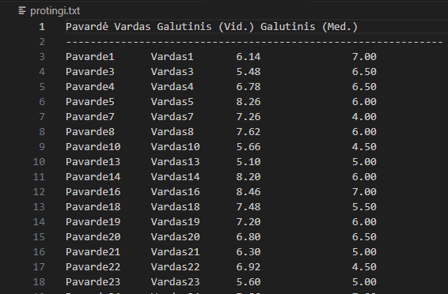
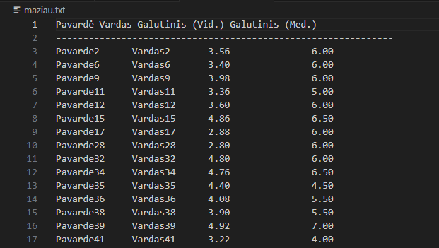

# Studentų pažymių valdymo sistema ir spartos analizė

## Aprašymas
Programa skirta:
- Įvesti studentų duomenis (rankiniu būdu, atsitiktinai arba iš failo)
- Apskaičiuoti galutinį pažymį pagal vidurkį ir medianą
- Suskirstyti studentus į dvi kategorijas:
  - **Protingi** (galutinis vidurkis ≥ 5.0)
  - **Ne tokie protingi** (galutinis vidurkis < 5.0)
- Išvesti rezultatus į failus
- Atlikti spartos analizę su skirtingais duomenų kiekiais (List ir Vector strategijos)

## Strategijos
- `Strategija 1` – Paprastas skirstymas į kategorijas naudojant iteracinį erase metodą:
  - Kiekvienas studentas tikrinamas ir perkeltas į atitinkamą vektorių arba sąrašą. 
  - Trūkumas: daug erase operacijų → gali būti O(n²) blogiausiu atveju.
- `Strategija 2` – Optimizuotas skirstymas naudojant std::partition:
  - Vienu perėjimu padalina duomenis į dvi grupes.
  - Naudojamas move ir vienkartinis erase → O(n) laikas.
- `Strategija 3` – Optimaliausias algoritmas (naudojant std::partition_copy arba copy_if):
  - Sukuria dvi atskiras kolekcijas vienu arba dviem perėjimais.
  - Mažiausiai realokacijų, geras našumas dideliems duomenų kiekiams.


## Projekto struktūra
- `main.cpp` – pagrindinė programos logika
- `functions.cpp` – funkcijų realizacija
- `vector.cpp` – funkcijų realizacija naudojant std::vector.
- `functions.h` – funkcijų deklaracijos
- `student.h` – struktūra `Student`
- Testiniai failai:
  - `studentai10.txt`
  - `studentai100.txt`
  - `studentai1000.txt`
  - `studentai10000.txt`
  - `studentai100000.txt`

## Perdengti metodai: įvestis ir išvestis (Student klasė)

Šiame projekte implementuoti perdengti įvesties ir išvesties metodai, leidžiantys patogiai dirbti su Student klase tiek naudojant standartinius srautus, tiek failus.

## Duomenų įvedimas

Rankinė įvestis `std::cin`
Perdengtas įvesties `operatorius >>` leidžia nuskaityti studento vardą ir pavardę iš klaviatūros.

Implementacija:
- Student s;
- cin >> s;

Šis metodas realizuotas perdengiant:
- `istream& operator>>(istream& in, Student& s);`

Naudojamas:
- `main.cpp` ir `ivedimas()` funkcijoje.

## Duomenų išvedinas

Išvestis į ekraną `std::cout`
Perdengtas išvesties `operatorius <<` leidžia atvaizduoti Student objektą ekrane:

Implementacija:
- cout << student;

Operatorius realizuotas:
- `ostream& operator<<(ostream& out, const Student& s);`

Naudojimas:
- Studentų rezultatams išvesti į failus:
- `protingi.txt`
- `maziau.txt`




## Paleidimo instrukcija (su g++)

### Kaip kompiliuoti
- Terminale:
  ```bash
  g++ -std=c++17 main.cpp v.pradine.cpp vector.cpp -o programa.exe
  ```

### Kaip paleisti
- Terminale:
  ```bash
  ./programa.exe
  ```
## idiegimo instrukcija

### Variantas A: Make (Unix/Linux/macOS)
- Įdiek g++ (pvz., `sudo apt install build-essential` arba `xcode-select --install` macOS).
- Terminale:
   ```bash
   make        # sukompiliuoja 'programa'
   make run    # paleidžia ./programa
   make clean  # išvalo build artefaktus
   ```

### Variantas B: CMake (Windows/Linux/macOS)
- Įdiek CMake (https://cmake.org) ir C++ kompiliatorių (MSVC arba MinGW Windows, gcc/clang Linux/macOS).
- Terminale:
  ```bash
  mkdir -p build && cd build
  cmake -DCMAKE_BUILD_TYPE=Release ..
  cmake --build . --config Release
  ```

### Programos paleidimas
- Terminale:
  ```bash
  ./programa                 # Linux/macOS
  .\Release\programa.exe     # Windows (MSVC)
  .\programa.exe             # Windows (MinGW)
  ```


# Programos veikimas pakeistas su Class

## NAUJI Spartos analizės rezultatai

### LIST - 1 strategija

| Failas              | Nuskaitymas (s) | Rūšiavimas (s) | Įrašymas (s) | Bendras (s) |
| ------------------- | --------------- | -------------- | ------------ | ----------- |
| studentai10.txt     | 0.000000        | 0.000005       | 0.003263     | 0.009514    |
| studentai100.txt    | 0.001478        | 0.000090       | 0.013258     | 0.027356    |
| studentai1000.txt   | 0.011640        | 0.000390       | 0.029551     | 0.045800    |
| studentai10000.txt  | 0.078304        | 0.004297       | 0.171989     | 0.258004    |
| studentai100000.txt | 1.029958        | 0.029662       | 2.138612     | 3.205476    |

### LIST - 2 strategija

| Failas              | Nuskaitymas (s) | Rūšiavimas (s) | Įrašymas (s) | Bendras (s) |
| ------------------- | --------------- | -------------- | ------------ | ----------- |
| studentai10.txt     | 0.000520        | 0.000003       | 0.002798     | 0.008564    |
| studentai100.txt    | 0.001608        | 0.000015       | 0.003090     | 0.011421    |
| studentai1000.txt   | 0.006825        | 0.000136       | 0.023586     | 0.038612    |
| studentai10000.txt  | 0.069184        | 0.000514       | 0.179034     | 0.251509    |
| studentai100000.txt | 0.856178        | 0.005642       | 1.854959     | 2.725951    |

### LIST - 3 strategija

| Failas              | Nuskaitymas (s) | Rūšiavimas (s) | Įrašymas (s) | Bendras (s) |
| ------------------- | --------------- | -------------- | ------------ | ----------- |
| studentai10.txt     | 0.000481        | 0.000006       | 0.013173     | 0.020066    |
| studentai100.txt    | 0.001485        | 0.000052       | 0.004503     | 0.021522    |
| studentai1000.txt   | 0.013401        | 0.000447       | 0.037441     | 0.057745    |
| studentai10000.txt  | 0.086479        | 0.007547       | 0.195556     | 0.295174    |
| studentai100000.txt | 1.680299        | 0.048475       | 1.956956     | 3.690595    |

## LIST pokitis pridėjus Class

| Failas              | Pokytis S1 (%) | Pokytis S2 (%) | Pokytis S3 (%) |
| ------------------- | -------------- | -------------- | -------------- |
| studentai10.txt     | −64 %          | +31 %          | −42 %          |
| studentai100.txt    | +114 %         | +62 %          | −85 %          |
| studentai1000.txt   | −16 %          | +57 %          | −34 %          |
| studentai10000.txt  | −25 %          | +21 %          | −43 %          |
| studentai100000.txt | −22 %          | +4 %           | −1 %           |


### Vector - 1 strategija

| Failas              | Nuskaitymas (s) | Rūšiavimas (s) | Įrašymas (s) | Bendras (s) |
| ------------------- | --------------- | -------------- | ------------ | ----------- |
| studentai10.txt     | 0.000294        | 0.000008       | 0.004795     | 0.016581    |
| studentai100.txt    | 0.000972        | 0.000067       | 0.004673     | 0.010106    |
| studentai1000.txt   | 0.007309        | 0.000207       | 0.028303     | 0.041310    |
| studentai10000.txt  | 0.067681        | 0.001429       | 0.166701     | 0.239431    |
| studentai100000.txt | 0.573965        | 0.008311       | 1.667649     | 2.257191    |

### VECTOR - 2 strategija

| Failas              | Nuskaitymas (s) | Rūšiavimas (s) | Įrašymas (s) | Bendras (s) |
| ------------------- | --------------- | -------------- | ------------ | ----------- |
| studentai10.txt     | 0.000466        | 0.000021       | 0.003100     | 0.010703    |
| studentai100.txt    | 0.001463        | 0.000146       | 0.002706     | 0.010808    |
| studentai1000.txt   | 0.007682        | 0.000347       | 0.015061     | 0.028531    |
| studentai10000.txt  | 0.053238        | 0.001095       | 0.125299     | 0.183045    |
| studentai100000.txt | 0.660618        | 0.020442       | 1.600361     | 2.285500    |

### Vector - 3 strategija

| Failas              | Nuskaitymas (s) | Rūšiavimas (s) | Įrašymas (s) | Bendras (s) |
| ------------------- | --------------- | -------------- | ------------ | ----------- |
| studentai10.txt     | 0.000607        | 0.000010       | 0.003074     | 0.008804    |
| studentai100.txt    | 0.001164        | 0.000037       | 0.003762     | 0.010684    |
| studentai1000.txt   | 0.007718        | 0.000158       | 0.020678     | 0.032670    |
| studentai10000.txt  | 0.065757        | 0.002209       | 0.274454     | 0.358372    |
| studentai100000.txt | 0.832484        | 0.019327       | 1.222532     | 2.082422    |

## Vector pokitis pridėjus Class

| Failas              | Pokytis S1 (%) | Pokytis S2 (%) | Pokytis S3 (%) |
| ------------------- | -------------- | -------------- | -------------- |
| studentai10.txt     | +189 %         | +73 %          | +29 %          |
| studentai100.txt    | +44 %          | +72 %          | −85 %          |
| studentai1000.txt   | +106 %         | +4 %           | −13 %          |
| studentai10000.txt  | +53 %          | +8 %           | +34 %          |
| studentai100000.txt | +37 %          | +58 %          | −32 %          |


## Pastabos
- Po visų atnaujinimų Vector laikas gerokai pamažėjo 1 > 2 > 3, kur su 3 Strategija, jis yra optimaliausias
- Po Class pridėjimo List kompiliacija pasikeitė, naujausi testai parodė, jog optimaliausia strategija tampa 2


## Optimizavimo flag'ų (O1/O2/O3) eksperimentinė analizė

Testai atlikti su `g++ (Debian 12.2.0)` ir tais pačiais įvesties failais (`studentai10.txt ... studentai100000.txt`). Buvo matuojamas **bendras laikas**, kurį programa išveda testavimo meniu punktuose (nuskaitymas + skirstymas + įrašymas į failus).

### Kompiliavimas
```bash
g++ -std=c++17 -O1 main.cpp v.pradine.cpp vector.cpp student.cpp -o programa_O1
g++ -std=c++17 -O2 main.cpp v.pradine.cpp vector.cpp student.cpp -o programa_O2
g++ -std=c++17 -O3 main.cpp v.pradine.cpp vector.cpp student.cpp -o programa_O3
```
```bash
./programa_O1
./programa_O2
./programa_O3
```

### Rezultatai (studentai100000.txt, bendras laikas sekundėmis)

| Konteineris | Strategija | -O1 (s) | -O2 (s) | -O3 (s) |
|---|---:|---:|---:|---:|
| List | 1 | 3.437516 | 3.485878 | 3.288404 |
| List | 2 | 2.105336 | 1.705389 | 1.897875 |
| List | 3 | 2.767923 | 2.270089 | 2.571799 |
| Vector | 1 | 1.667047 | 1.629618 | 2.166511 |
| Vector | 2 | 1.680681 | 1.987534 | 2.173088 |
| Vector | 3 | 1.955111 | 1.618937 | 3.026942 |

## Testavimo sistemos parametrai
| Parametras | Reikšmė |
|------------|---------|
| CPU | 11th Gen Intel(R) Core(TM) i5-1145G7 @ 2.60GHz |
| RAM | 16 GB DDR4 |
| HDD / SSD | NVMe SSD |
| OS | Windows 11 Enterprise x64 |
